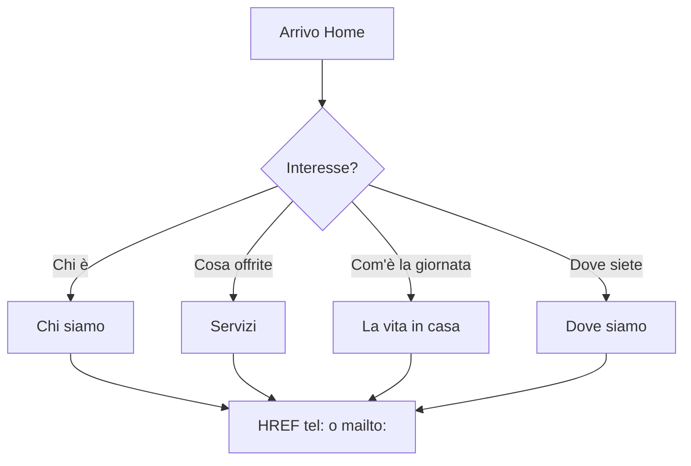

# 02 — Strategia UX/UI

**Progetto:** Casa Allegramente · Casa famiglia, Rivarolo Canavese (TO)  
**Principio guida:** *Casa dolce casa* — calore domestico, mai estetica clinica o ospedaliera

---

## 1. Contesto e obiettivi del sito

Il sito non è un portale sanitario né un e-commerce. È uno **strumento di fiducia** per:

1. **Familiari** che valutano una struttura per un genitore o congiunto.
2. **Anziani** che esplorano autonomamente (crescente) o con supporto familiare.
3. **Comunità locale** — medici di base, vicini, volontari, istituzioni del Canavese.

### Obiettivi misurabili (UX)

| Obiettivo | Indicatore di successo |
|-----------|------------------------|
| Comprendere cos’è Casa Allegramente in < 30 secondi | Scroll hero + manifesto senza confusione |
| Trovare contatti e indirizzo | ≤ 2 tap da qualsiasi pagina (header tel, footer, Dove siamo) |
| Percepire ambiente “casa” vs “clinica” | Test qualitativo con 3–5 familiari target |
| Navigare senza frustrazione (anziani) | Font leggibile, contrasto AA, tap target ≥ 44px |
| Funzionare su smartphone | Mobile-first; > 60% traffico atteso da mobile |

### Obiettivo escluso

- **Acquisizione lead via form web** — non presente. La conversione è **chiamata telefonica** o **visita in sede**.

---

## 2. Personas e bisogni

### 2.1 Maria — Figlia (55 anni), decisore primario

- **Contesto:** Cerca casa famiglia dopo peggioramento del padre post-ospedalizzazione.
- **Bisogni:** Capire posti disponibili, tipo assistenza, costi indicativi (se comunicabili), vicinanza a Rivarolo, recensioni/testimonianze, come prenotare visita.
- **Paure:** Struttura impersonale, odori “ospedale”, padre isolato.
- **Comportamento:** Sera su smartphone, confronta 2–3 siti, mostra al fratello.
- **Design response:** Sezione Chi siamo emotiva, foto reali, numeri chiari (ospiti max, h24), CTA “Chiama per una visita” sempre visibile.

### 2.2 Giuseppe — Ospite potenziale (78 anni), parzialmente autosufficiente

- **Contesto:** Coinvolto nella decisione, timoroso del “trasloco”.
- **Bisogni:** Vedere camere, routine giornaliera, attività, tono rassicurante.
- **Paure:** Perdere autonomia, ambiente freddo.
- **Comportamento:** Tablet con figlio; font piccolo difficile; preferisce pochi testi lunghi.
- **Design response:** Tipografia grande, paragrafi brevi, timeline visiva “una giornata tipo”, linguaggio “Lei” rispettoso.

### 2.3 Laura — Vicina / referente territoriale (40 anni)

- **Contesto:** Segnala la struttura a conoscenti.
- **Bisogni:** Indirizzo, mappa, orari visite, identità locale (Rivarolo, Canavese).
- **Design response:** Pagina Dove siamo completa, riferimenti territoriali, link mappe.

---

## 3. Tono visivo: “Casa dolce casa”

### 3.1 Cosa comunicare

| ✅ Sì | ❌ No |
|------|------|
| Calore, luce naturale, tavola imbandita, giardino | Verde acqua “ospedale”, bianco sterile dominante |
| Foto reali della struttura e del personale (con consenso) | Stock generico di infermieri in tute |
| Tipografia serif elegante per titoli + sans leggibile per corpo | Font tech, maiuscolo aggressivo |
| Palette terra, salvia, crema, accento caldo (ambra/oro) | Blu clinico, grigio freddo |
| Spazi bianchi generosi, ritmo lento | Animazioni frenetiche, parallax eccessivo |
| Linguaggio: accoglienza, abitudini, comunità | Linguaggio: paziente, degenza, reparto |

### 3.2 Riferimento dal sito esempio (Residence V.G)

Il brief `BRIEF_SVILUPPO.md` dell’esempio codifica esattamente questa direzione:

- Sfondo globale **Linen** `#F5F2ED` (mai bianco puro come sfondo pagina).
- Verde **foresta/salvia** per autorevolezza e natura.
- **Oro caldo** per CTA e dettagli premium.
- Tipografia **Cormorant Garamond** (display) + **Inter** (body, min 16px).

Casa Allegramente **eredita i principi**, non necessariamente la palette identica (vedi doc 03 — brand in bozza).

### 3.3 Mood board concettuale

- Sala comune con luce di finestra.
- Dettagli domestici: tovaglia, piante, cornici.
- Mani che accompagnano (non che “curano” in modo invasivo).
- Esterno: Canavese, colline, paese — radicamento territoriale.

---

## 4. Accessibilità per utenti anziani

Obiettivo: **WCAG 2.1 livello AA** come baseline.

### 4.1 Tipografia

| Elemento | Specifica |
|----------|-----------|
| Body minimo | **18px** preferito (16px assoluto minimo) |
| Line-height | 1.6–1.75 per paragrafi |
| Titoli | Scala modulare: H1 40–48px desktop, 32px mobile |
| Peso | Evitare testo sotto 400; titoli 600 max (non 700 sottile su serif) |
| Maiuscolo | Solo label brevi (es. “SERVIZI”); mai paragrafi interi caps |

**Enhancement opzionale (fase 2):** toolbar “Testo più grande” (+1 step = 20px, +2 = 22px) via classe `text-lg` su `<html>`.

### 4.2 Contrasto colore

- Testo corpo su sfondo linen: rapporto ≥ **4.5:1**.
- Testo su bottoni gold: verificare contrasto (testo scuro `ink` su gold chiaro, o gold su forest scuro).
- Link: sottolineatura o colore distinto + `:focus-visible`.

### 4.3 Interazione touch e mouse

- **Tap target minimo 44×44px** (bottoni, link nav, icona telefono).
- Spaziatura tra link footer ≥ 8px.
- Stati `:focus-visible` con anello 2px ad alto contrasto (es. gold su forest).

### 4.4 Navigazione semplificata

- **Max 5 voci** nel menu principale (allineate alle 5 pagine).
- Nessun mega-menu, nessun dropdown a più livelli.
- **Skip link** “Vai al contenuto principale” come primo elemento focusabile.
- Breadcrumb opzionale su pagine interne (utile per screen reader, non obbligatorio visivamente se nav chiara).

### 4.5 Motion e animazioni

Allineamento al sito esempio (Framer Motion v11):

1. Animazioni **lente** (0.4–0.8s), easing morbido.
2. **`prefers-reduced-motion`:** disabilitare translate/scale; mantenere al massimo fade breve.
3. **Nessun autoplay** aggressivo tranne eventuale carousel testimonianze con pausa e controllo.
4. **No loop infiniti** decorativi.

### 4.6 Contenuti

- Linguaggio **chiaro**, frasi brevi, evitare acronimi sanitari senza spiegazione (OSS sì con contesto).
- **Alt text** descrittivi sulle foto (“Sala pranzo con tavola apparecchiata e luce naturale”).
- Video: sottotitoli se presenti; controllo play/pause visibile.

### 4.7 Semantica HTML

```html
<header> → logo + nav
<main id="main-content"> → contenuto pagina
<nav aria-label="Navigazione principale">
<section aria-labelledby="servizi-heading">
<footer>
```

---

## 5. Mobile-first responsive

### 5.1 Breakpoints (Tailwind default)

| Breakpoint | Uso |
|------------|-----|
| default | Mobile 320–639px — design primario |
| `sm` 640px | Telefoni grandi |
| `md` 768px | Tablet — nav può restare hamburger fino a `lg` |
| `lg` 1024px | Desktop — nav orizzontale |
| `xl` 1280px | Container max 1200px |

### 5.2 Pattern mobile-specifici

| Pattern | Implementazione |
|---------|-----------------|
| Header sticky compatto | Logo + hamburger; al scroll sfondo blur/white |
| **Floating CTA telefono** | FAB in basso a destra (come esempio `FloatingCTA.tsx`) — sempre `tel:` |
| Menu full-screen | Overlay con link grandi, contatti in fondo menu |
| Griglie servizi | 1 colonna mobile → 2 (`md`) → 3 (`lg`) |
| Timeline giornata | Verticale mobile; orizzontale o zig-zag desktop |
| Mappa | 100% larghezza, altezza min 280px, iframe lazy |

### 5.3 Performance mobile

- Immagini hero **< 200 KB** versione mobile (WebP).
- Evitare video hero su connessioni lente; `prefers-reduced-data` (futuro) o solo immagine su mobile.
- Font subset latin only.

---

## 6. Pattern di navigazione

### 6.1 Architettura nav primaria

```
[Logo Casa Allegramente]     Home | Chi siamo | Servizi | La vita in casa | Dove siamo     [📞 Chiama]
```

- Voce attiva: sottolineatura gold o peso semibold + `aria-current="page"`.
- CTA telefono in header desktop (icona + numero abbreviato).
- Mobile: hamburger + tel nel menu.

### 6.2 Flussi utente principali



### 6.3 Home come hub (non monolite infinito)

La Home **sintetizza** e linka alle pagine dedicate:

- Anteprima Chi siamo → “Scopri la nostra storia” → `/chi-siamo`
- Anteprima Servizi (3–4 card) → `/servizi`
- Anteprima Routine → `/la-vita-in-casa`
- Blocco contatto + mappa mini → `/dove-siamo`

Evitare homepage scroll infinito stile esempio (12 sezioni) **senza** vie d’uscita verso pagine — per Casa Allegramente, equilibrio: **6–8 sezioni** in Home + profondità nelle pagine interne.

### 6.4 Footer

Colonne:

1. Logo + tagline breve  
2. Navigazione (ripetizione link principali)  
3. Contatti (tel, email, indirizzo)  
4. Legale (Privacy PDF, Cookie) + P.IVA se applicabile  

---

## 7. Componenti UX chiave (per pagina)

### Home

| Sezione | Scopo UX |
|---------|----------|
| Hero | Value proposition + 2 CTA (Chiama / Scopri) |
| Stats bar | 4 numeri rassicuranti (ospiti, h24, anni, …) |
| Manifesto | 3 valori con icone |
| Anteprime | Card verso pagine interne |
| Testimonianze | Prova sociale (se disponibili) |
| FAQ | Ridurre ansie frequenti |
| Contatto | Blocco tel/mailto — **no form** |

### Chi siamo

- Storia, missione, team (foto), galleria struttura.
- Enfasi su **dimensione familiare** e territorio Rivarolo.

### Servizi

- Griglia 6 servizi (come esempio) con espansione o card flip semplice.
- Box “Cosa è incluso” — trasparenza senza listino se non fornito dal cliente.

### La vita in casa

- Timeline 07:30–21:30 (pattern `DailyRoutine.tsx` esempio).
- Attività, pasti, momenti sociali — narrativa quotidiana.

### Dove siamo

- Mappa embed (OpenStreetMap o Google Maps static/iframe).
- Indicazioni auto/mezzi.
- Orari visite.
- **ContactBlock** prominente.

---

## 8. Microcopy e tono di voce

| Contesto | Tono | Esempio |
|----------|------|---------|
| Hero | Accogliente, diretto | “Una casa per la terza età, nel cuore del Canavese” |
| CTA primaria | Azione umana | “Chiamaci per una visita” (non “Invia richiesta”) |
| Servizi | Rassicurante | “Assistenza discreta, sempre presente” |
| Errori 404 | Caldo | “Pagina non trovata — torna alla home o chiamaci” |

**Pronome:** “Lei” verso ospite e familiare; “noi” per la struttura. Evitare “paziente”, “degenza”, “ricovero”.

---

## 9. Fiducia e credibilità (trust signals)

Senza form, la fiducia si costruisce con:

1. **Foto autentiche** (non solo stock).
2. **Numeri concreti** (posti, anni attività, personale qualificato).
3. **FAQ** oneste (costi, visite, cosa portare).
4. **Dati legali** visibili (ragione sociale, P.IVA se applicabile).
5. **JSON-LD** LocalBusiness per Google Maps / ricerca locale.
6. **Testimonianze** con nome e relazione (“Figlia di ospite”) — solo con consenso scritto.

---

## 10. Checklist UX pre-lancio

- [ ] Navigazione completabile solo da tastiera
- [ ] Contrasto verificato (WebAIM Contrast Checker)
- [ ] Test su iPhone Safari + Chrome Android
- [ ] Tap telefono apre dialer su mobile reale
- [ ] Nessun form presente nell’intero sito
- [ ] `prefers-reduced-motion` testato
- [ ] Lettura ad alta voce (screen reader NVDA/VoiceOver) su Home e Contatti
- [ ] Tempo caricamento Home < 3s su 4G throttled

---

*Documento 02 — Strategia UX/UI · Casa Allegramente · v1.0*
